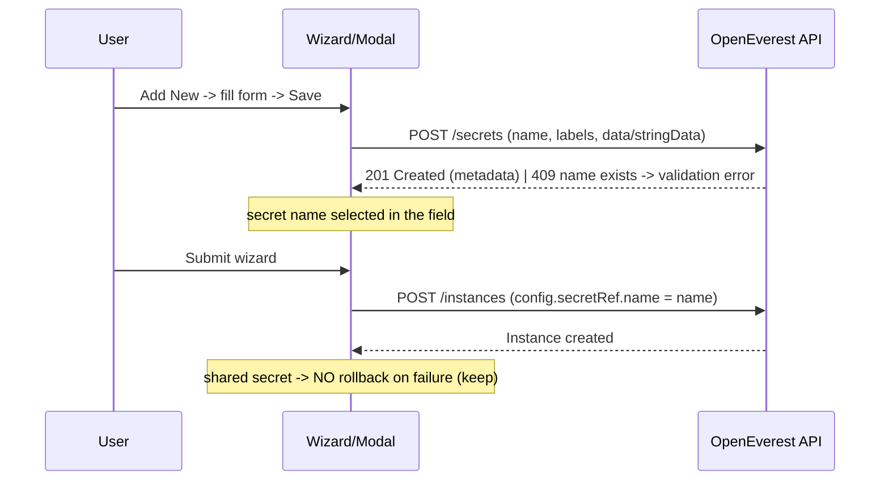

# Generic Secret Support in the UI Generator

**Status:** Draft (for team alignment)
**Scope:** UX & API contracts (not file-level implementation)
**First consumer:** Split-horizon TLS in the instance-creation wizard
**Last updated:** 2026-07-10

---

## 1. Concept

The UI Generator gains a new `secret` field type. Through a form, the user **creates a
Kubernetes Secret** (or **selects an existing one**), and the Instance spec stores the
Secret's **name**. The mechanism is **generic and reusable**: split-horizon TLS today, any
future service that needs a "create a secret, then reference it" flow.

The secret form is described **declaratively by the provider** (ui-schema); all behavior
(modal, requests, error handling, rollback) lives in the **core UI Generator**.

---

## 2. UX Flow

### 2.1 Where it appears

The split-horizon field is delivered to the wizard **from the provider schema** (the MongoDB
provider includes the component; MySQL/PostgreSQL do not). Everything is **schema-driven** —
the UI never branches on DB type.

### 2.2 The `secret` field (a wizard step control)

Rendered as a **select**:

- A list of **existing** managed secrets, filtered by `provider` / `category` (for reuse).
- An **"+ Add New …"** option (label comes from the schema, e.g. "Add New Certificate").
- Selecting an existing secret → the Instance simply references it by name.

### 2.3 The "Add New" modal (secret-creation form)

Opens on "Add New"; fields are rendered **from the secret's ui-schema**. For split-horizon:

- **Secret name** — text, user-provided (the secret is shared → user-named).
- **Certificate** — file upload (`.crt` / `.pem`).
- **Private key** — file upload (`.key` / `.pem`).
- Actions: **Save** / **Cancel**.

### 2.4 States & errors

- **Name collision** (shared secret): existing name → validation error "name already exists";
  the user picks another name **or** selects the existing secret from the dropdown.
- **List loading**: spinner / "Loading…"; empty list → just "Add New".
- **No permission (RBAC)**: hide/disable "Add New" based on `create`.
- **File**: required-field and type validation.

### 2.5 Editing & reuse

- **No secret editing** — only **create** and **delete**. To change a secret: delete and
  create a new one.
- A shared secret is **reused** by multiple instances (via the select) and **persists** after
  an instance is deleted.

### 2.6 Open UX decision — when is the secret created?

|         | (A) Immediately on modal "Save"                                                                      | (B) Deferred, on wizard submit                                       |
| ------- | ---------------------------------------------------------------------------------------------------- | -------------------------------------------------------------------- |
| **Pro** | Secret is instantly available in the select and to other instances; simpler model for shared secrets | No orphan secret if the wizard is abandoned                          |
| **Con** | Abandoning the wizard leaves a secret (but it's shared/persistent, cleaned up in Settings)           | Must hold `File` objects in form state; more complex; needs rollback |

**Recommendation:** for **shared** secrets (split-horizon) use **(A)** — create on Save, like
creating a BackupStorage; no rollback on instance failure (keep). For **per-instance** secrets
(import, later) use **(B)** with a compensating `DELETE`. Behavior is **per secret kind**.

---

## 3. API Contracts (UI ↔ Backend)

### 3.1 Endpoints

| Method     | Path                                                        | Purpose                                          |
| ---------- | ----------------------------------------------------------- | ------------------------------------------------ |
| `GET`      | `/clusters/{c}/namespaces/{ns}/secrets?provider=&category=` | List (metadata only) for the select              |
| `POST`     | `/clusters/{c}/namespaces/{ns}/secrets`                     | Create a secret                                  |
| `DELETE`   | `/clusters/{c}/namespaces/{ns}/secrets/{name}`              | Delete                                           |
| `GET`      | `/clusters/{c}/providers`                                   | Provider schema with **inline** secret ui-schema |
| _(future)_ | secret-definitions endpoint                                 | Standalone rendering for the Settings page       |

No `PUT` / upsert. `GET` returns **metadata only** (never secret values).

### 3.2 Create (POST) body

```json
{
  "metadata": { "name": "<user-provided>" },
  "labels": {
    "openeverest.io/category": "component-splithorizon",
    "openeverest.io/provider": "provider-percona-server-mongodb"
  },
  "data": { "ca.crt": "<base64>", "ca.key": "<base64>" }
}
```

- `labels` are set by the UI, **except** `openeverest.io/managed`, which is added by the backend.
- Use `data.<key>` (base64) for `uiType: file` fields; use `stringData.<key>` (plaintext) for
  `uiType: text` / password fields.

**Field-type → secret-field mapping:**

- `uiType: file` → `data.<key>` (base64)
- `uiType: text` / password → `stringData.<key>` (plaintext)

### 3.3 Reference in the Instance spec

A plain string: `spec.…​.config.secretRef.name = "<secret-name>"`
(confirmed by BE — direct reference, **no intermediate CR**).

### 3.4 Create-and-reference sequence



### 3.5 Labels contract

- `openeverest.io/managed` — backend only (CRUD returns only managed secrets).
- `openeverest.io/category` — set statically by the UI (e.g. `component-splithorizon`).
- `openeverest.io/provider` — optional (the instance's provider name); used to filter the select.

---

## 4. Responsibility Split

- **Core UI Generator:** modal, POST/GET/DELETE, payload assembly (`data`/`stringData`),
  error mapping, rollback policy, writing the name into `path`.
- **Schema author (UI team):** the secret ui-schema (fields, `path`, `uiType: secret`/`file`,
  `category` label). The UI team owns the provider ui-schema since it owns the UI Generator.
- **Backend:** the `/secrets` API, the `managed` label, lifecycle/GC (owner references),
  server-side validation.

---

## 5. Status

**Agreed**

- Direct secret reference, plain string at `config.secretRef.name` (no intermediate CR).
- Split-horizon secret is **shared / persistent / user-named**; reuse via dropdown.
- Operations: `POST` / `GET` / `DELETE` (no upsert); user-facing **create + delete** only.
- `uiType: file` → `data` (base64); `uiType: text`/password → `stringData`.
- Fully schema-driven; secret ui-schema is **inlined** in the provider schema.

**Pending from Backend**

- Finalized `/secrets` OpenAPI; RBAC resource name; secret-definitions endpoint (future);
  API availability; decision on the `file` `accept` hint.

**Deferred**

- Data importer, ConfigMaps, Settings-page secret management, multi-provider shared secrets.

**Needs team decision**

- §2.6 — when the secret is created (on modal Save vs on wizard submit).
