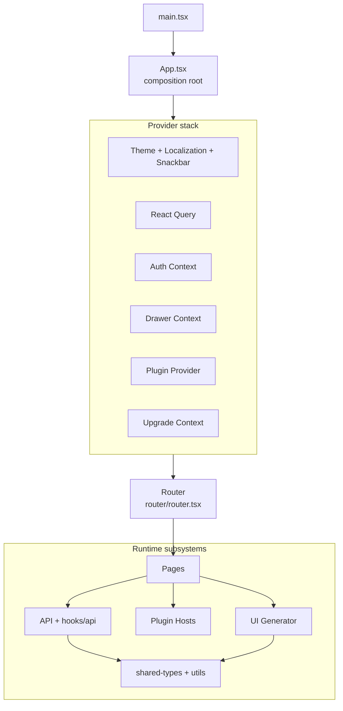
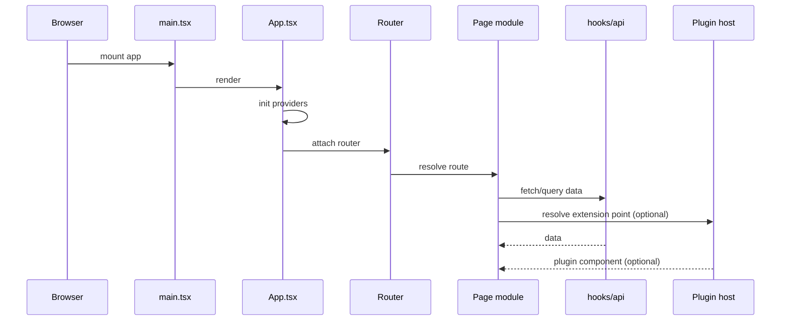

# Everest App: High-Level Architecture

This document captures Everest application architecture without
page-level or component-level implementation details.

## Application Structural Diagram

## Runtime Flow (Simplified)

## Key Architectural Anchors

1. **Composition root** —
   [App.tsx](../../../ui/apps/everest/src/App.tsx),
   [main.tsx](../../../ui/apps/everest/src/main.tsx).
   Entry point that mounts the React tree and wraps it in the provider stack
   (theme, auth, React Query, plugins, upgrade banner, etc.).

2. **Provider stack** —
   Nested context providers that supply global state and services to the entire app:
   - _Theme + Localization + Snackbar_: MUI theme, i18n, toast notifications.
   - _React Query_: server-state cache, background refetching, optimistic updates.
   - _Auth Context_: JWT session, login/logout flow, token refresh.
   - _Drawer Context_: sidebar open/closed state.
   - _Plugin Provider_: loads plugin bundles, collects registered extensions, exposes them via `usePlugins()`.
   - _Upgrade Context_: detects available Everest upgrades and shows a banner.

3. **Routing** —
   [router.tsx](../../../ui/apps/everest/src/router/router.tsx).
   Declarative route tree (react-router-dom). Maps URL paths to page components,
   defines layout shells, handles route guards (auth required, namespace scoping),
   and mounts plugin route extensions at `/plugins/:pluginName/*`.

4. **Pages** —
   [pages/](../../../ui/apps/everest/src/pages).
   Top-level route modules, one directory per logical page/wizard
   (e.g. `databases/`, `database-form/`, `db-cluster-details/`, `settings/`).
   Each page orchestrates API hooks, UI Generator forms, and plugin extension points.

5. **UI Generator subsystem** —
   [components/ui-generator/](../../../ui/apps/everest/src/components/ui-generator)
   ([architecture docs](./ui-generator/)).
   Schema-driven engine that renders forms, wizards, detail views, and dialogs
   from JSON schema + UI schema. Schemas are authored by provider developers
   in their provider repos (`definition/topologies/<name>/topology.yaml`,
   scaffolded by [provider-sdk](https://github.com/openeverest/provider-sdk))
   and delivered to the UI via the Provider CR's `spec.uiSchema`.
   Used across most data-driven pages.

6. **Plugin hosts** —
   [components/plugin-host/](../../../ui/apps/everest/src/components/plugin-host).
   Bridge components that render plugin-provided React components at designated
   extension points (full page, detail tabs, settings tabs). Each host resolves
   the correct extension, passes typed props, and wraps output in an error boundary.

7. **API layer (hooks/api)** —
   [hooks/api/](../../../ui/apps/everest/src/hooks/api).
   React Query-based hooks that encapsulate REST calls to the Everest backend.
   Each resource (clusters, backups, restores, storages, namespaces, etc.) has
   a dedicated hook file with query keys, fetch functions, and mutations.

8. **Shared types + utils** —
   Workspace packages `@percona/types` and `@percona/utils`.
   Shared TypeScript interfaces (API response shapes, enums) and pure utility
   functions consumed by both the app and library packages.

## Metadata

- Owner: UI
- Last updated: 2026-06-11
