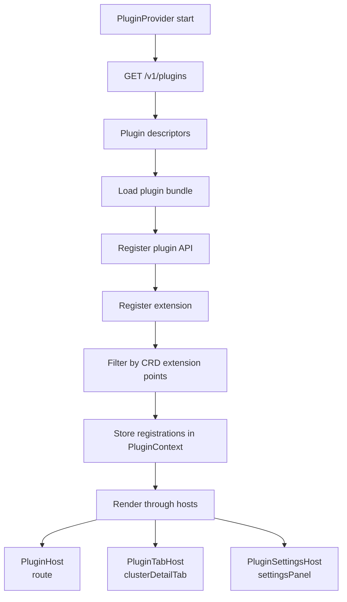
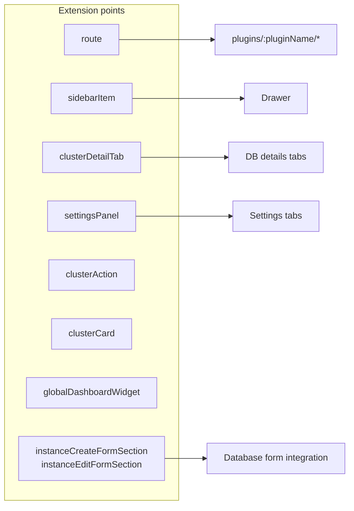

# UI Plugins Architecture

This document explains how plugins integrate with the UI,
which extension points are supported, and where integration boundaries exist.

## Plugin Lifecycle

## Extension Points Map (High Level)

## Integration Boundaries

1. Plugins are loaded and registered via PluginProvider.
2. Plugin rendering always goes through host components.
3. Plugin component errors are isolated by PluginErrorBoundary.
4. Plugin extensions are limited by extension points declared in CRD.

## Key Files

1. [../../../ui/apps/everest/src/contexts/plugins/plugins.context.tsx](../../../ui/apps/everest/src/contexts/plugins/plugins.context.tsx)
2. [../../../ui/apps/everest/src/components/plugin-host/PluginHost.tsx](../../../ui/apps/everest/src/components/plugin-host/PluginHost.tsx)
3. [../../../ui/apps/everest/src/components/plugin-host/PluginTabHost.tsx](../../../ui/apps/everest/src/components/plugin-host/PluginTabHost.tsx)
4. [../../../ui/apps/everest/src/components/plugin-host/PluginSettingsHost.tsx](../../../ui/apps/everest/src/components/plugin-host/PluginSettingsHost.tsx)
5. [../../../ui/packages/plugin-sdk](../../../ui/packages/plugin-sdk)

## Related Documents

1. [../../process/generic-plugins-design.md](../../process/generic-plugins-design.md)
2. [./everest-app-overview.md](./everest-app-overview.md)

## Metadata

- Owner: UI
- Last updated: 2026-06-11
