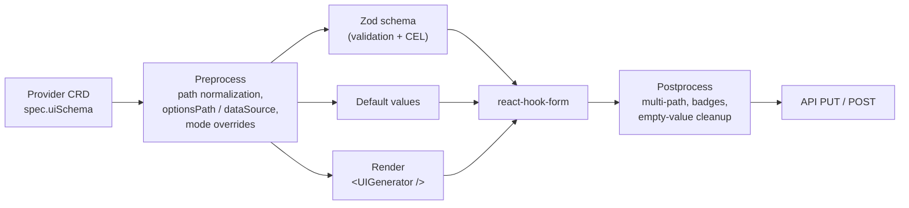

# UI Generator — developer documentation

**UI Generator** is a schema-driven form engine. From a JSON/YAML schema delivered in the
`Provider CRD` (`spec.uiSchema`), it builds the database creation wizard and the section-edit
modals on the cluster overview page. A provider developer describes the form **declaratively** —
the engine renders the fields, assembles validation (zod + CEL), computes default values, and
maps the data back to the API.

This documentation explains the engine top-down: **modules, functions, principles**, and
**every prop** you can set in a schema.

## Where it lives

`ui/apps/everest/src/components/ui-generator/`

- `ui-generator.tsx` — root rendering component.
- `ui-generator.types.ts` — **defines** every prop (schema types).
- `utils/` — pipeline stages (preprocess / schema-builder / postprocess / component-renderer).
- `api-providers/` — API option providers (dataSource).
- `form-engine/` — multi-step wizard.

## High-level pipeline

See [pipeline.md](./pipeline.md) for details.

## Documentation map

| Doc                                              | About                                                                  |
| ------------------------------------------------ | ---------------------------------------------------------------------- |
| [schema-reference.md](./schema-reference.md)     | **Every prop** as a tree — what the schema can express                 |
| [pipeline.md](./pipeline.md)                     | Modules, functions, and principles per pipeline stage                  |
| [User-facing docs](../../ui-generator/Readme.md) | Schema authoring guide: field types, validation, groups, API providers |

## Diagram legend

- **No marker** — implemented (present in code).
- **`🛠️` / dashed border** — planned (proposal) or declared in the type but not wired up yet (mermaid `planned` class).

## Metadata

- Owner: UI
- Status: current
- Last updated: 2026-09-02
