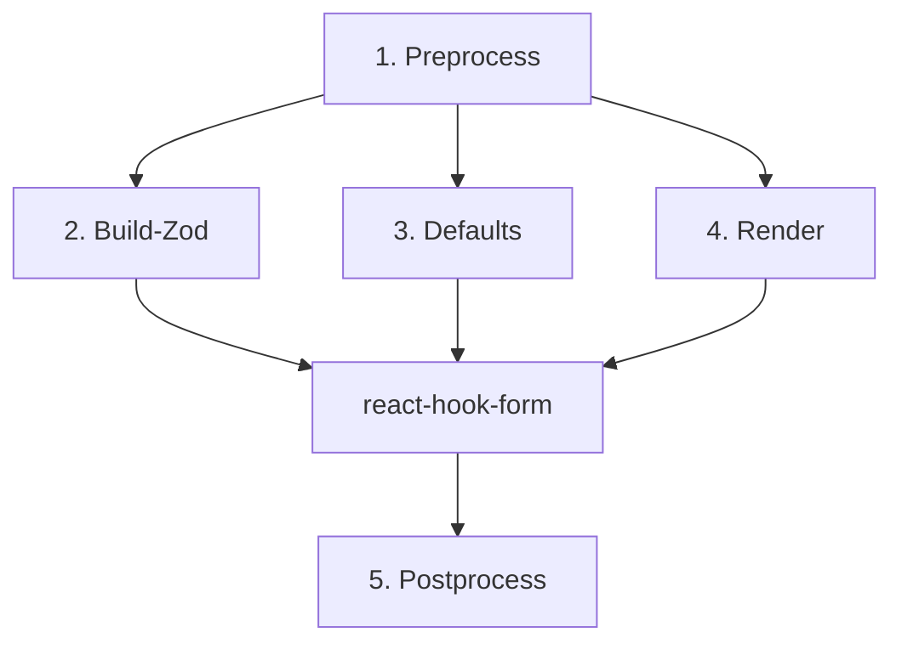
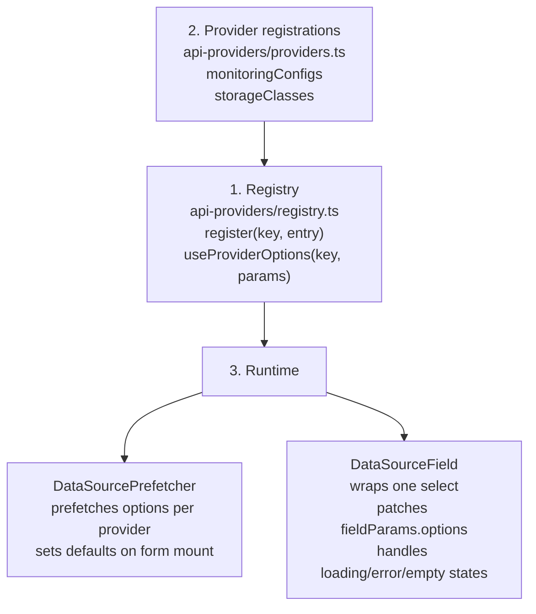
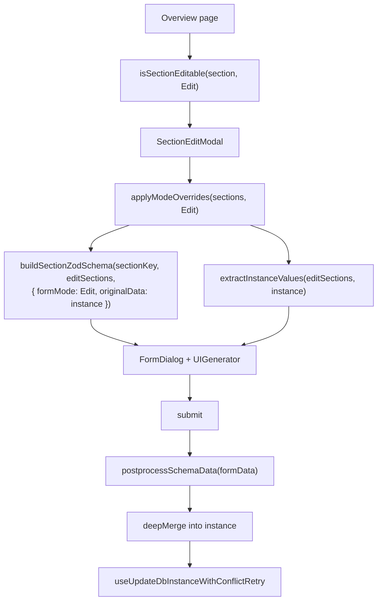

# UI Generator (modules, functions, principles)

> Mirrors the code in `components/ui-generator/` and the types in `ui-generator.types.ts`.

The schema goes through 5 stages: **Preprocess → (Build-Zod ‖ Defaults ‖ Render) → Postprocess**.
Key principle — **path metadata is computed once** in preprocess and reused by all stages
(no repeated tree traversal).



## 1. Preprocess

**Files:** `utils/preprocess/`
**Input:** raw `TopologyUISchemas` + `Provider` object. **Output:** normalized sections.

- **`preprocessSchema(schema, provider)`** — for each component:
  - **`withNormalizedPathMeta`** → `_normalized.sourcePath` / `targetPaths` (parses `path` — a string
    or an array for multi-path). This is the only place paths are parsed.
  - **`resolveSelectOptions`** — `optionsPath` → static `options[]` (reads the array from the Provider
    by path, maps `labelPath` / `valuePath`).
  - **`dataSource` validation** — for a component with `dataSource: { provider }`, warns (dev-time) if
    the provider is not registered. Options are not resolved here — they are loaded at runtime by
    `DataSourceField` and prefetched by `DataSourcePrefetcher`.
- **`applyModeOverrides(sections, formMode)`** (`apply-mode-overrides.ts`) — applies `modes` overrides
  for the current `FormMode`.

**Principle:** after this stage the tree is ready — nothing parses paths again.

## 2. Build-Zod (validation)

**Files:** `utils/schema-builder/`
**Input:** normalized sections. **Output:** `z.ZodTypeAny` for `zodResolver` (react-hook-form).

- **`buildZodSchema(schema, topology, options?)`** — full wizard.
- **`buildSectionZodSchema(sectionKey, sections, options?)`** — section edit modal: rules are built
  only for the target section, the root uses `.passthrough()`, but **CEL is collected from all
  sections** (cross-field rules).
- For each component, internally:
  - **`resolveValidationForMode(validation, formMode)`** — merges base rules and `modes[formMode]`
    (scalars replace, `celExpressions` append, `inheritShared: false` ignores the base).
  - **`buildShapeFromComponents`** — `ZOD_SCHEMA_MAP[uiType]` (base zod type) +
    `applyValidationFromSchema` (min/max/regex/required/…) + CEL expression collection.
  - **`convertToNestedSchema`** — flat fields → nested `z.object`.
  - **`applyCelValidation(schema, celExprs, originalData?)`** — attaches CEL (in edit mode the
    `original` namespace — persisted instance data — is available).

**Principle:** validation is **mode-aware** and **declarative** — providers don't write resolvers by hand.

## 3. Defaults

**Files:** `utils/default-values/`
**Output:** a `defaultValues` object for `useForm`.

- Collects initial values from `fieldParams.defaultValue` (create).
- **`extractInstanceValues`** — in edit/restore, reads values **only from the instance** (by
  `sourcePath`), **without** schema defaults (so edit doesn't inject defaults).

## 4. Render

**Files:** `ui-generator.tsx`, `utils/component-renderer/`, `ui-component/`, `api-providers/`

- **`<UIGenerator sectionKey sections providerObject formMode namespace />`** — root.
- **`UiGeneratorProvider`** (context) — provides `provider`, `formMode`, `namespace`, and loading
  down the tree.
- **`orderComponents(components, componentsOrder)`** — field order.
- **`renderComponent({ item, name })`** — recursive traversal:
  - `group` / `hidden` → recurse into nested `components`;
  - leaf → `generateFieldId(item, name)` (form field name) →
    - has `dataSource` → `<ComponentErrorBoundary><DataSourceField><UIComponent/></DataSourceField></ComponentErrorBoundary>`
      (the wrapper loads options through `api-providers/registry` and sets a default via `useEffect`);
    - otherwise → `<ComponentErrorBoundary><UIComponent/></ComponentErrorBoundary>`.
- **`UIComponent`** — maps `uiType` to a concrete input (`@percona/ui-lib`: SelectInput / TextInput /
  SwitchInput …).

**Principle:** every component is isolated by `ComponentErrorBoundary` — a single failing field doesn't break the form.

### API-backed select fields (`dataSource`)

`dataSource.provider` connects a select to API options through three layers:



`getDefaultValues()` runs synchronously before the API responds, so `dataSource` fields start with
an empty value. The default is set asynchronously in two places: `DataSourcePrefetcher` on form
mount and `DataSourceField` when the specific field renders. Both check the current value via
`getValues(path)` before writing, so they never overwrite a user selection or an existing value.

## 5. Postprocess

**Files:** `utils/postprocess/`
**Input:** form data (RHF). **Output:** a clean API payload.

- **`postprocessSchemaData(formData, { schema, selectedTopology })`**:
  - **`extractMultiPathMappings` / `applyMultiPathMappings`** — one value → all `targetPaths`.
  - **`extractBadgeMappings` / `applyBadgesToFormData`** — unit suffix (`8` → `8Gi`).
  - **`removeEmptyFieldValues`** — strip `undefined` / `null` / `""`.

**Principle:** the mapping source is the same `_normalized` computed in preprocess.

## Section edit modal flow



The edit modal reuses the same `UIGenerator` but validates only the target section via
`buildSectionZodSchema`; other fields pass through `.passthrough()`, while CEL dependencies are
collected from all sections.

## Cross-cutting principles

1. **Single path pass** — `_normalized` is computed in preprocess and reused by validation / render /
   postprocess.
2. **Discrimination by `uiType`** — type-safe `fieldParams` / `validation` per field type.
3. **Mode-aware everywhere** — a single `FormMode` drives component / fieldParams / validation overrides.
4. **The schema is a public contract** (third-party provider schemas) → prop names are frozen pre-GA.
5. **Error isolation** — `ComponentErrorBoundary` around every render.
6. **Engine reuse** — the section edit modal uses the same UIGenerator + `buildSectionZodSchema`.

## Modes — override matrix

Each `modes` object overrides only the properties of the object it belongs to.

| `modes` in…         | Overrides                                                                  | Status          |
| ------------------- | -------------------------------------------------------------------------- | --------------- |
| `component.modes`   | `uiType` (e.g. `edit → hidden`)                                            | implemented     |
| `fieldParams.modes` | `disabled`, `readOnly`, `label`, `helperText`, `defaultValue`, `autoFocus` | implemented     |
| `validation.modes`  | any validation field + `inheritShared`                                     | implemented     |
| `group.modes`       | `hidden` / `disabled` at the group level                                   | planned (#3080) |

```yaml
components:
  dbName:
    uiType: text
    path: metadata.name
    modes:
      restore:
        uiType: hidden
    fieldParams:
      label: Database name
      modes:
        edit:
          disabled: true
```

## Key files

| Area                       | File                                                       |
| -------------------------- | ---------------------------------------------------------- |
| Types                      | `ui-generator.types.ts`                                    |
| Main component             | `ui-generator.tsx`                                         |
| Context                    | `ui-generator-context.tsx`                                 |
| Preprocess                 | `utils/preprocess/preprocess-schema.ts`                    |
| Mode overrides             | `utils/preprocess/apply-mode-overrides.ts`                 |
| Zod builder                | `utils/schema-builder/build-zod-schema.ts`                 |
| Section Zod                | `utils/schema-builder/build-section-zod-schema.ts`         |
| CEL validation             | `utils/schema-builder/cel-validation/`                     |
| Defaults                   | `utils/default-values/`                                    |
| Instance values            | `utils/default-values/extract-instance-values.ts`          |
| Section editability        | `utils/section-editable/is-section-editable.ts`            |
| Renderer                   | `utils/component-renderer/render-component.tsx`            |
| UI component mapper        | `ui-component/`                                            |
| Postprocess                | `utils/postprocess/postprocess-schema.ts`                  |
| Schema walker              | `utils/schema-walker/schema-walker.ts`                     |
| Object path                | `utils/object-path/object-path.ts`                         |
| API provider registry      | `api-providers/registry.ts`                                |
| API provider registrations | `api-providers/providers.ts`                               |
| DataSourceField            | `api-providers/data-source-field/data-source-field.tsx`    |
| DataSourcePrefetcher       | `api-providers/data-source-prefetcher.tsx`                 |
| Error boundary             | `component-error-boundary/component-error-boundary.tsx`    |
| Monitoring options hook    | `hooks/api/monitoring/useMonitoringConfigsOptions.ts`      |
| Storage classes hook       | `hooks/api/kubernetesClusters/useStorageClassesOptions.ts` |

## Metadata

- Owner: UI
- Status: current
- Last updated: 2026-09-02
