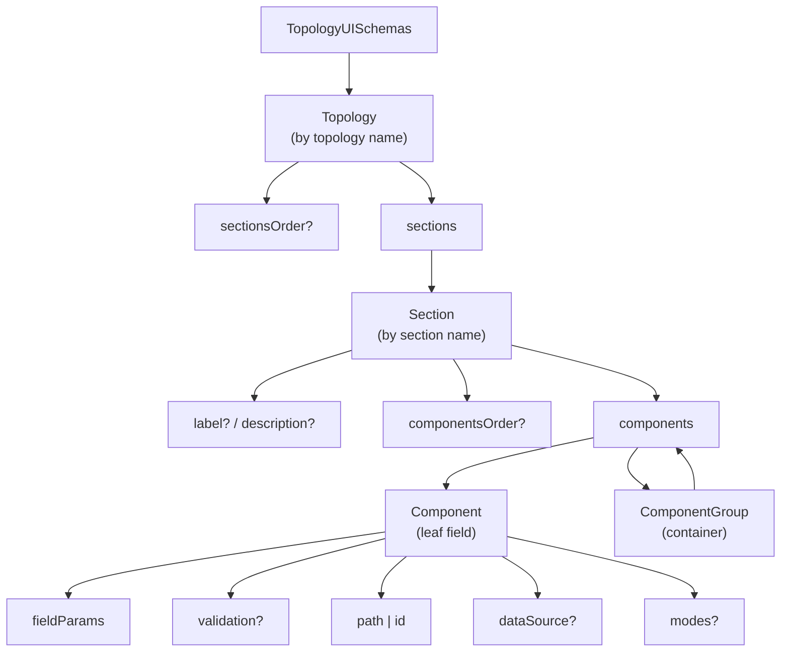
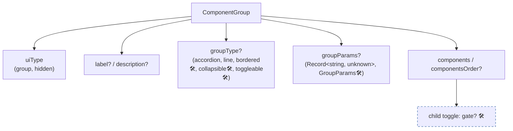
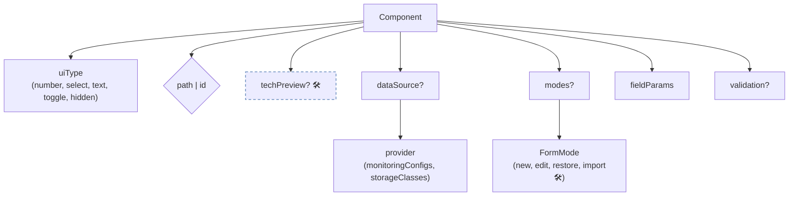
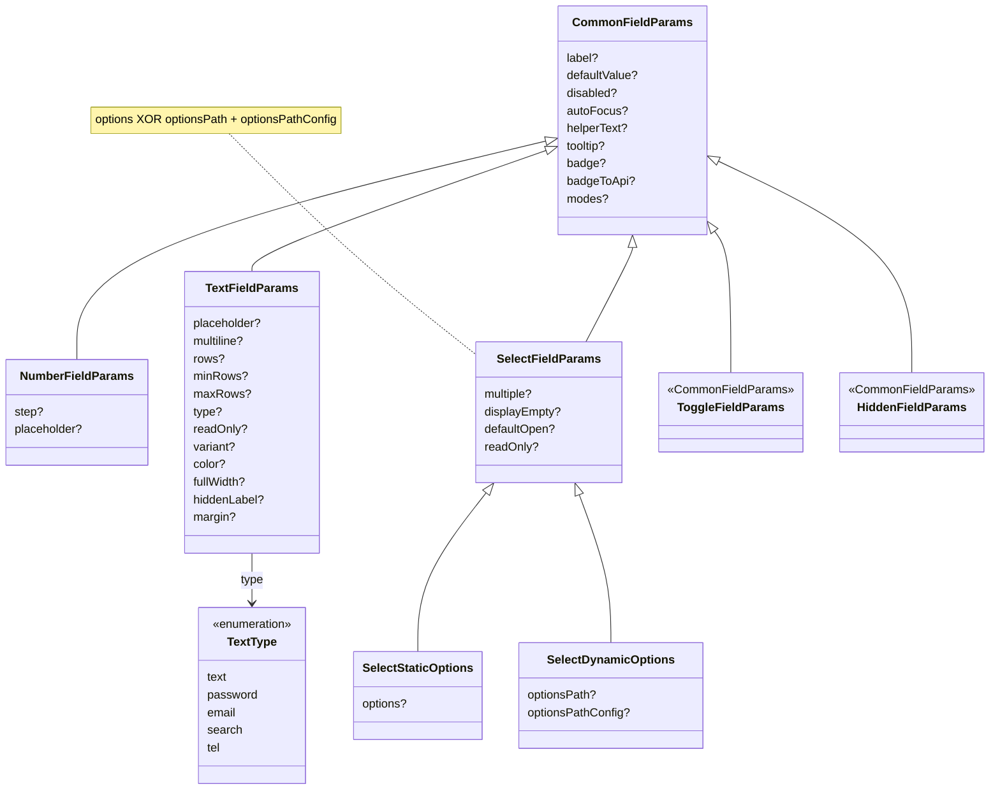
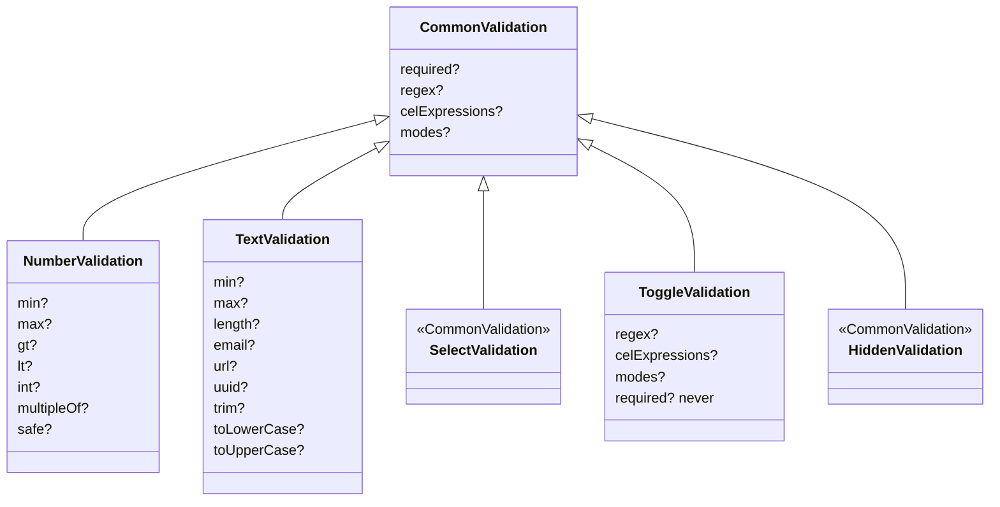

# UI Generator — Schema Reference (props tree)

> Schema props are defined in `ui-generator.types.ts`.
> **Legend:** no marker means implemented; `🛠️` means planned / not implemented yet. In flowcharts, non-implemented nodes also use a dashed border.

Read the diagrams top-down: topology → sections → components (leaf fields) / groups (containers) → their params.

## Overview Map

## Level 2 — ComponentGroup (container)

`gate` 🛠️ is a flag on a child `toggle` (part of the group-kernel proposal, tracked separately).

## Level 2 — Component (leaf field)

- **`path` | `id`** — `path` (`string` | `string[]`) writes to the API; an array is a multi-path (`[0]` is the source, all entries are targets). `id` has no API binding and is used only for validation / CEL.
- **`dataSource.provider`** — a key in the open runtime registry (`register()`), not a closed enum.
- **`modes?`** — `{ [FormMode]: { uiType? } }`; `import` is declared in the enum but is not used by the code.

## Level 3 — fieldParams (by field type)

## Level 3 — validation (by field type, mode-aware)

- **modes (mode-aware)** — `{ [FormMode]: <same rules> + inheritShared? }`.
- **`toggle`** — `required` is always optional (`never`).
- **`select` / `hidden`** — common rules only.

## Cross-Cutting Concepts

| Concept                        | Meaning                                                                                                                                                                                                                          | Status      |
| ------------------------------ | -------------------------------------------------------------------------------------------------------------------------------------------------------------------------------------------------------------------------------- | ----------- |
| **FormMode**                   | `new · edit · restore · import` controls `modes` at three levels: component `uiType`, `fieldParams`, and `validation`                                                                                                            | implemented |
| **multi-path**                 | `path: [a, b]` writes the same value to all targets                                                                                                                                                                              | implemented |
| **dataSource / API providers** | `dataSource: { provider }` names an API-backed option source; preprocess dev-validates the provider key, and at runtime `DataSourceField` loads the options through the registry (`DataSourcePrefetcher` sets defaults on mount) | implemented |
| **CEL validation**             | Cross-field validation rules declared via `celExpressions` (with an `original` namespace available in edit mode)                                                                                                                 | implemented |
| **CEL conditional rendering**  | Show / hide fields based on another field value through a generic mechanism                                                                                                                                                      | 🛠️          |
| **group kernel**               | `groupType: bordered/collapsible/toggleable` + `gate` + `direction`                                                                                                                                                              | 🛠️          |

## To Consider

- **`fieldParams.badge` / `badgeToApi`** — currently inherited by all field types through `CommonFieldParams`; visual badge rendering is supported for `number` and `select`, while `text` / `toggle` / `hidden` have asymmetric behavior.

## Metadata

- Owner: UI
- Status: current
- Last updated: 2026-09-02
