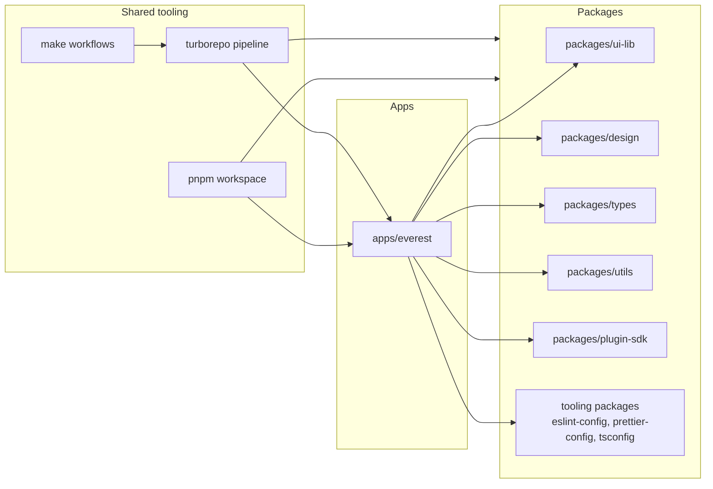

# UI Monorepo: High-Level Overview

This document describes the main blocks of the UI monorepo,
their responsibilities, and dependency directions.

## Structural Diagram

## Block Responsibilities

1. Apps:
   contain product applications; currently this is
   [../../../ui/apps/everest](../../../ui/apps/everest).
2. Packages:
   contain reusable UI libraries, design/tokens, types, utilities, and
   plugin contract SDKs.
3. Shared tooling:
   orchestrates builds, linting, testing, and shared workflows across workspaces.

## Boundaries and Dependency Direction

1. The application consumes libraries from packages.
2. Packages must not depend on the application.
3. Tooling orchestrates apps/packages and does not contain product logic.

## Metadata

- Owner: UI
- Last updated: 2026-06-11
