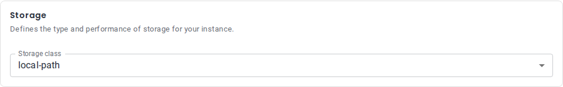
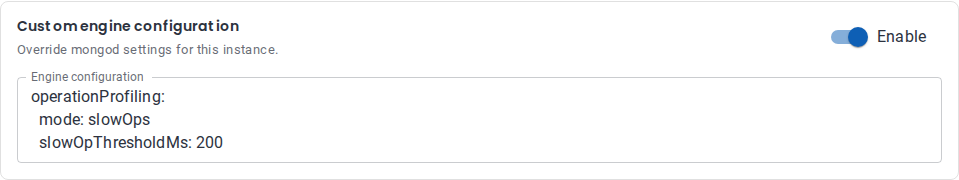

# Groups

Groups allow you to organize multiple fields together with different layout options.

## Table of Contents

- [Line Group](#line-group)
- [Accordion Group](#accordion-group)
- [Bordered Group](#bordered-group)
- [Toggleable Group](#toggleable-group)

Related: [Number Field](components/number-field.md), [Select Field](components/select-field.md), [Text Field](components/text-field.md), [Validation](validation.md)

## Line Group

//TODO will be renamed, documentation should be checked before merging
Displays components in a horizontal line (flex layout).

```yaml
resourceGroup:
  uiType: group
  groupType: line
  label: Resources
  components:
    cpu: { ... }
    memory: { ... }
    disk: { ... }
  componentsOrder:
    - cpu
    - memory
    - disk
```

//TODO visual example

## Accordion Group

Displays components in a collapsible accordion panel.

```yaml
advancedSettings:
  uiType: group
  groupType: accordion
  label: Advanced Settings
  description: Optional advanced configuration
  components:
    setting1: { ... }
    setting2: { ... }
```

//TODO visual example

## Bordered Group

A static bordered card around related fields. Visual only: fields keep their own `path`.

- `label` and `description` are optional. Omit both for a plain box without a heading.
- Can contain other groups, e.g. a `line` group.

```yaml
storage:
  uiType: group
  groupType: bordered
  label: Storage
  description: Defines the type and performance of storage for your instance.
  components:
    storageClass:
      uiType: text
      path: spec.components.engine.storage.class
      fieldParams:
        label: Storage class
  componentsOrder:
    - storageClass
```



## Toggleable Group

A bordered card with an **Enable** switch. The switch exists only in the form and is not sent to the API.

```yaml
monitoring:
  uiType: group
  groupType: toggleable
  label: Monitoring
  components:
    endpoint:
      uiType: text
      path: spec.monitoring.endpoint
      fieldParams:
        label: Endpoint
      validation:
        required: true
  componentsOrder:
    - endpoint
```

**Behavior**

- **Off:** fields are hidden, not validated, and removed from the request. On an existing instance, turning it off deletes the saved values.
- **Initial state:** off for a new instance; on if the instance already has a value in any of the group's fields.
- **Topology switch:** a group with the same section and group keys in both topologies keeps its state; any other group starts off.

**Rules** — if one is broken, the group renders as a plain bordered group:

- The group has at least one field with a `path`.
- No field outside the group writes the same `path`.
- No toggleable inside another toggleable.
- Section and group keys use only letters, digits, `_` and `-` (temporary, see below).

**Keep in mind**

- A CEL rule outside the group sees the group's fields as absent while it is off. Guard them with `has()`: `!has(spec.monitoring.endpoint) || ...`.
- Don't put fields that are read-only in edit mode inside the group: turning it off deletes them too.

**Current limitations**

- The switch can't be disabled: form `modes` apply to fields, not to groups, so the group is always switchable. Group-level `modes` (`hidden` / `disabled` per form mode) are planned in [#3080](https://github.com/openeverest/openeverest/issues/3080).
- The key rule is temporary: the switch name is built from the keys, and keys with `.`, `~` or brackets need the shared path encoding planned in [#3221](https://github.com/openeverest/openeverest/issues/3221).
- Backup-class schemas (backups, schedules, PITR) don't support toggleable groups yet: see [#3268](https://github.com/openeverest/openeverest/issues/3268).



